# Visit Iceland Project 2

The link to live project can be found here - title(https://declanwatts97.github.io/code-institute-project-2/)
The link to github repository can be found here - title (https://github.com/declanwatts97/code-institute-project-2)

### Introduction

Welcome to Visit Iceland! We are a travel guide for tourists planning a trip to Iceland, and more specifically Reykjavik. Explore our site for some of our best offerings of day trips, night time activities, and some general information about Iceland as a whole. Test your knowledge of Iceland with our short interactive quiz!

## User Experience

### User Requirements

The website has been created with the below goals in mind:

1. Accessability - The website needs to be accessible so that all users are free to view with no issues.

2. Device friendly - The website needs to be able to be viewed on all device sizes and browsers to ensure as large a consumer base as possible.

3. Trips offered - The website needs to offer our most popular trips in Iceland, so the consumer can book when interested.

4. Simplicity - The website needs to be as simplistic as possible, so the users can easily navigate to the selling points and nothing else will distract from this.

## User Stories
### Website Visitors

1. As a user I require clear images, so I can accurately assess what the trips are about and for a pleasant viewing experience.

2. As a user I require easy navigation, so I can make my way to which page is required for me planning my trip.

3. As a user I require the website to be responsive, to ensure I can access the site on any device.

4. As a user I require information about the country of Iceland. This is to let me know the ins and outs of the country and give me an idea of the area I am visiting.

5. As a user I require some facts about Iceland. This is to improve my knowledge prior to my trip.

6. As a user I require an interactive quiz, to test my knowledge gained from reading the site.

7. As a user, I require suggestions of the most popular trips to take when visiting Iceland.

8. As a user I require a working footer, for ease of access to the socials of the organisation.

### Goals of Site Developers

1. As a developer I want clean code which follows the standard for readablility for ease of making any changes and so it can be understood by any other contributors.

2. As a developer I want my code to follow the standard for accessibility, so that it is a pleasant viewing experience for consumers.

3. As a developer I require the README document to be as detailed as possible, to outline the design and implementation stage of the project.

## Structure

This site has 3 pages and an interactive quiz on the index page.

### Navbar

The navbar has two active links, to the day trips page and the night activities page. The organisation name in the navbar works as the link back to home. The navbar switches to a menu burger icon on smaller screen sizes.

### Footer

The footer has 4 social media icons, to Facebook, Instagram, X and Youtube. It also has 4 links to Home, About, News and Contact. The links to all social media take you to the relevant pages and the Home link takes you back to home. The rest of the links will be added as more pages are added.

### Home Page

The home page has 3 main sections. First is the hero image with the name of the site and some hero text below. Then comes the information and facts about Iceland section. This is then followed by the interactive quiz.

The interactive quiz links back to the facts about Iceland so the consumer can test their knowledge about what they have read.

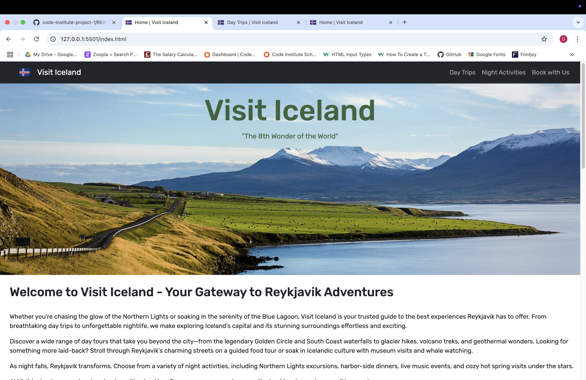

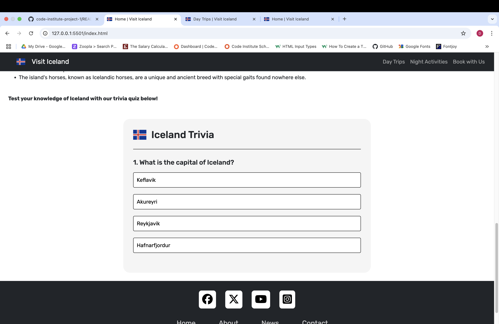

### Day Trips

The day trips page has 3 main sections. It has the hero image and title to show which page you are on, followed by and intro to the day trips section. This is then followed by 4 cards which show the top trips/attractions on offer.

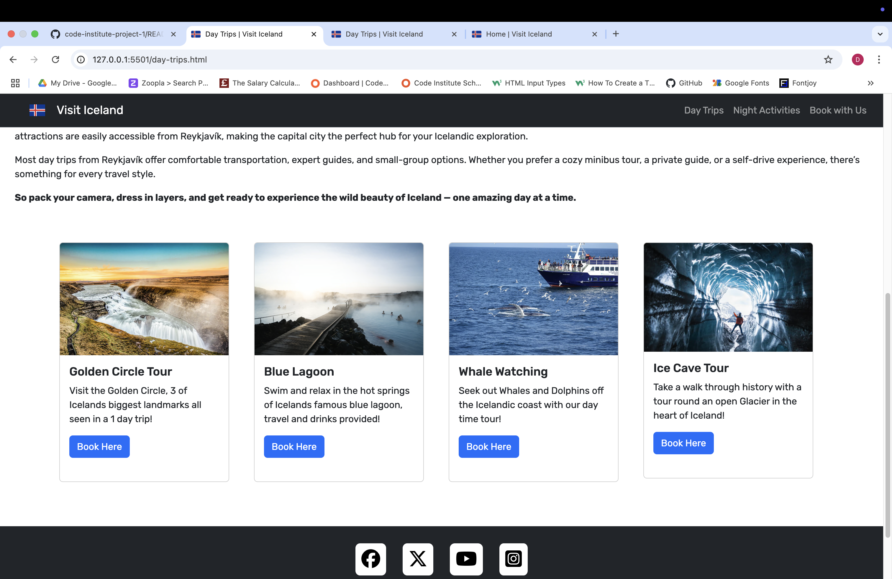

### Night Activities

The night activities page follows on from the day trips page and has 3 main sections. It has the hero image and title to show which page you are on, followed by and intro to the day trips section. This is then followed by 4 cards which show the top trips/attractions on offer.

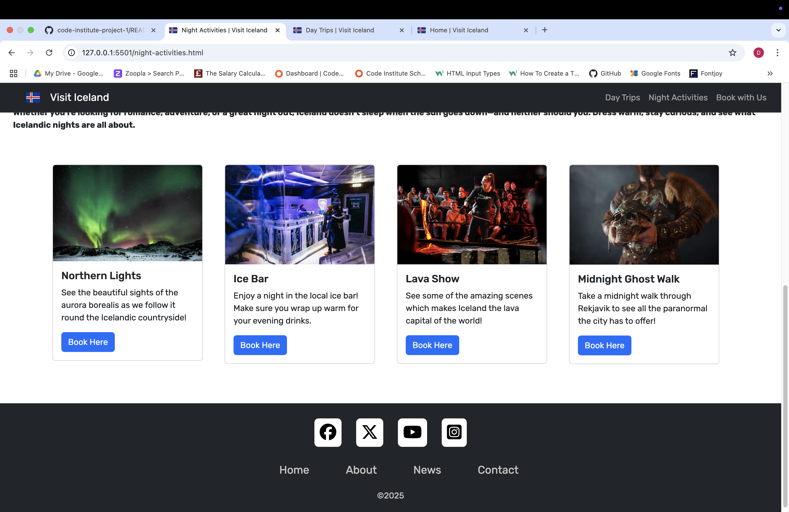

## Design

### Wireframes

The below wireframes were created at the beginning of the design process, these were to be the layout followed for the creation of the site:

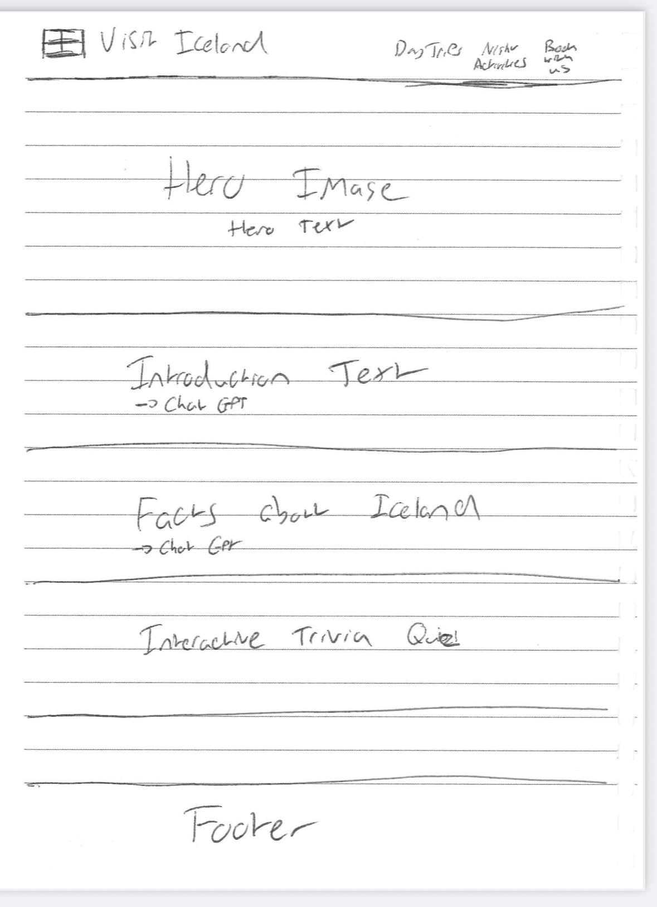

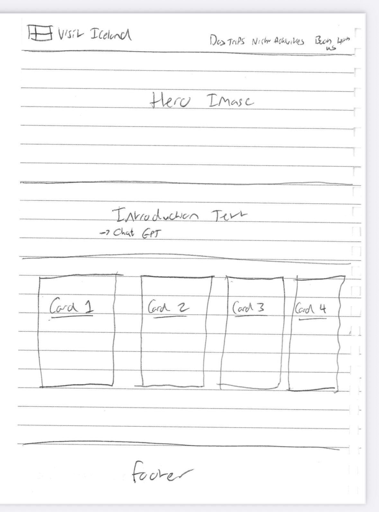

### Colour Scheme

- The main colour scheme was black for the header and footer, and white for the body of the pages.
- The main colour scheme for the text of the webpage was green for the headers and black for the body text.
- These schemes offer contrasting shades so everything stands out in a professional design.
- The buttons on the navbar are shaded blue on hover, in a contrast to the dark background.

### Font

- The font used in this project was Rubik, and with sans serif as a backup font. These were taken from Google Fonts and linked in the head of pages.

## Imagery

All images used on this project were taken from unsplash or GetYourGuide.

Unsplash was used for the hero images and GetYourGuide for the card images.

## Technologies Used

### Development Tools
- Github: For hosting code through repositories and deployment.
- VS Code: Used for writing and testing local code prior to sending to github.
- HTML5: The standard language of a web page.
- CSS3: For styling the website.
- Javascript - For creating the interactive trivia quiz.
- Bootstrap 5.3: To create responsive design and also some webpage features.
- Font Awesome: For adding all logos used on page.
- Favicon.io: For adding the favicon on the title bar of webpage.
- Flagicons.lipis.dev - For adding the Icelandic flag to the webpage.
- ChatGPT - filler text for webpages provided by ChatGPT.

## Deployment

### Deployment to GitHub Pages

This site has been deployed to GitHub pages. To view, please see below:

1. View the GitHub repository. This project is found at title (https://github.com/declanwatts97/code-institute-project-2)
2. You can view the deployment on github pages by visiting title(https://declanwatts97.github.io/code-institute-project-2/)

### Deployment Procedure

See below step by step instructions for how to deploy to GitHub pages:

1. Navigate to the GitHub repository, the link for this project is in the section above.
2. Scroll down to the Pages section in the left sidebar and then select.
3. Under Brach, you need to select the main branch and save.
4. After saving, GitHub will deploy your site. Refresh the page and you will see a link under the github pages section, linking you to your deployment.

## Testing

Testing is extremely important in the development of a website, allowing you to ensure all code is working as it should. The two types of testing available to a developer are manual testing and automated testing. These are both important tools which should be used every step of the way.

### Principles of Automated Testing

Automated testing can provide consistent testing of a websites purpose and output. It is more efficient when it comes to fast and repeatable test scenarios, where a software or program is designed for purpose. It takes away the human element meaning you know what you are getting from it. It will give you a result one way or another based on how it is designed to test. This is more suited to a fast paced development environment where feedback is required more often and high volume checks are needed.

### Principles of Manual Testing

Manual Testing is primarily done to evaluate aspects of design and development which the automated tests may overlook. This includes the user experience, along with responsivity and usability. This is best done to ensure user stories are being followed and the site is fit for purpose. This can require a human element of opinion rather than the output of a designed software which doesn't always see the full picture.

### User Stories Testing

1. As a user I require clear images. I tested this by ensuring all images gathered were if the correct orientation and size. I also made sure they were resized to smaller file sizes so they load in faster.

2. As a user I require easy navigation. I tested this by getting a friend to navigate through the website on both laptop and mobile to ensure the links were easy to find and worked as a consumer would require.

3. As a user I require the website to be responsive. This was tested on google dev tools to ensure it was responsive on all screen sizes and then on my phone, laptop and tablet to ensure the deployed version matches the local version.

4. As a user I require information about the country of Iceland. This was tested by asking a friend to let me know if they believed the information was sufficient for someone who had never visited.

7. As a user I require an interactive quiz. This was tested by getting a friend to read through the facts provided and see if the questions were possible to learn the answers to for someone who has no knowledge of the country.

8. As a user, I require suggestions of the most popular trips to take when visiting Iceland. I tested this by finding the most viewed and booked trips from a secondary source and checking all based has been covered.

9. As a user I require a working footer, for ease of access to the socials of the organisation. I tested this by accessing all the links on the footer from all website pages.

10. As a developer I want clean code which follows the standard for readablility. This was tested by running the code through a validator and ensuring best practices had been followed.

12. As a developer I require the README document to be as detailed as possible, to outline the design and implementation stage of the project. I ensured this was done by creating a plan prior to writing the readme of everything which needed to be included.

### Manual Testing

1. Navigation - I tested the navigation by clicking on the navbar links to the other two webpages, and the website header to return to the home page. This worked as expected.

2. Footer - I tested the footer by clicking each social media icon and ensuring that these link to the relevant social media page. As the company doesnt have social media yet these just link direct to the webpage of each social media provider.

3. Webpage Responsiveness - Each webpage was tested across multiple screen sizes, to ensure that everything works as it should. I tested this mainly through Chrome's developer tools, as well as my laptop and mobile phone. Screenshots are shown below (Day trips and night activities page using same code so responsiveness is the same):

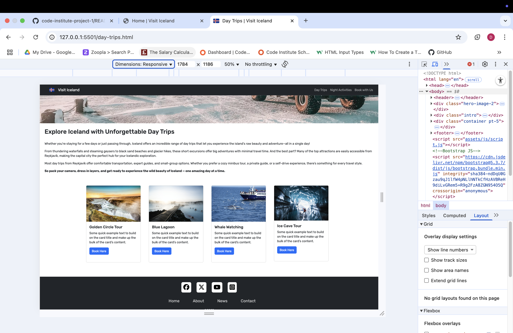

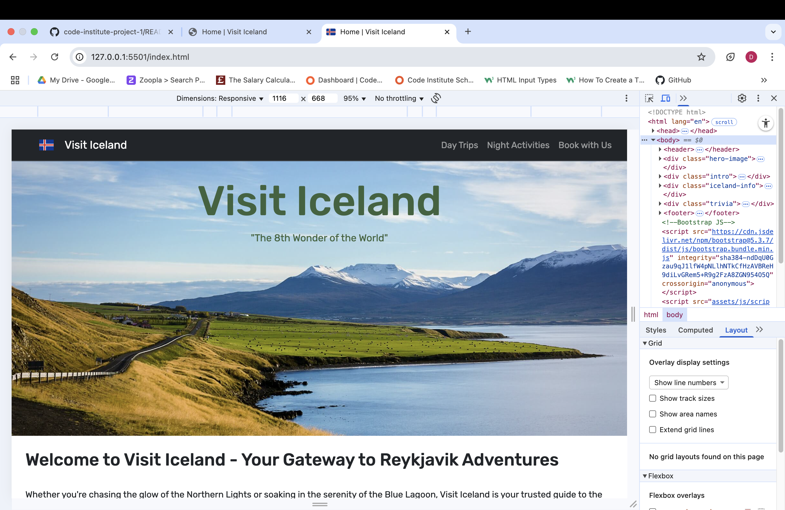

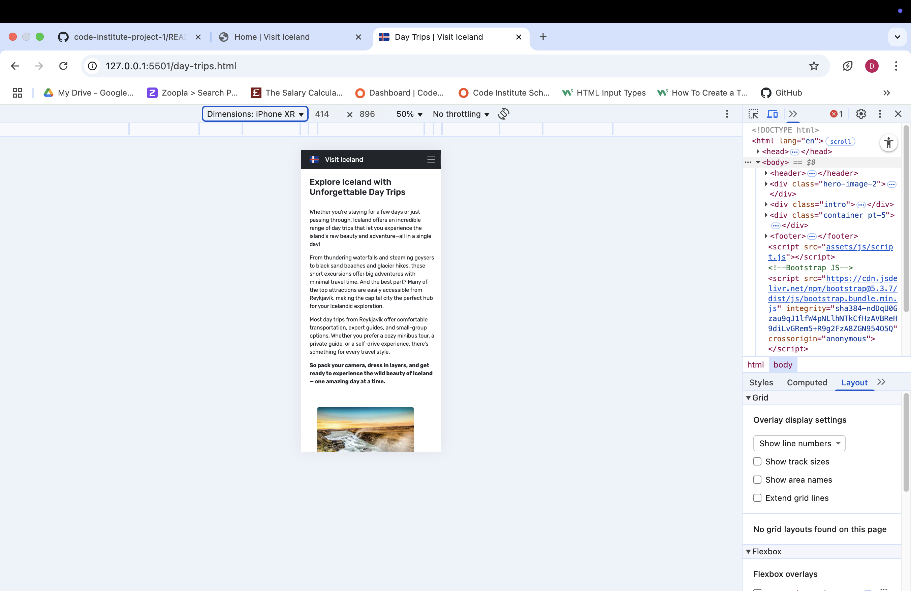

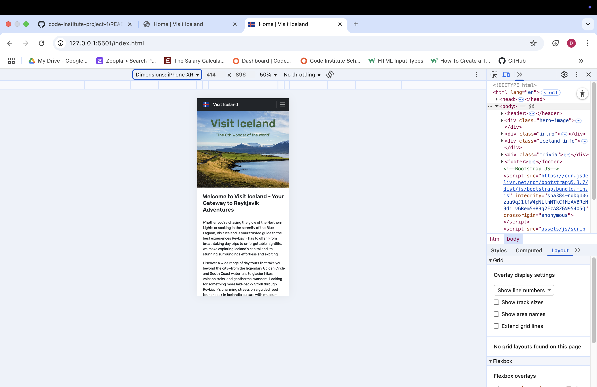

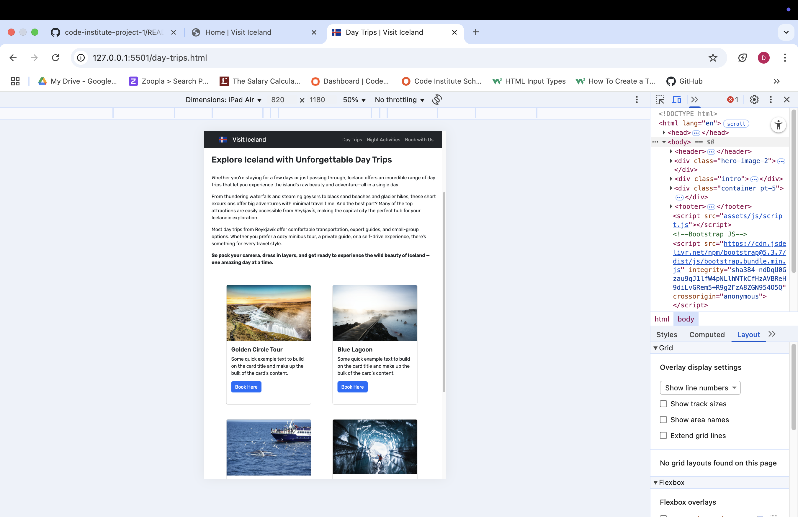

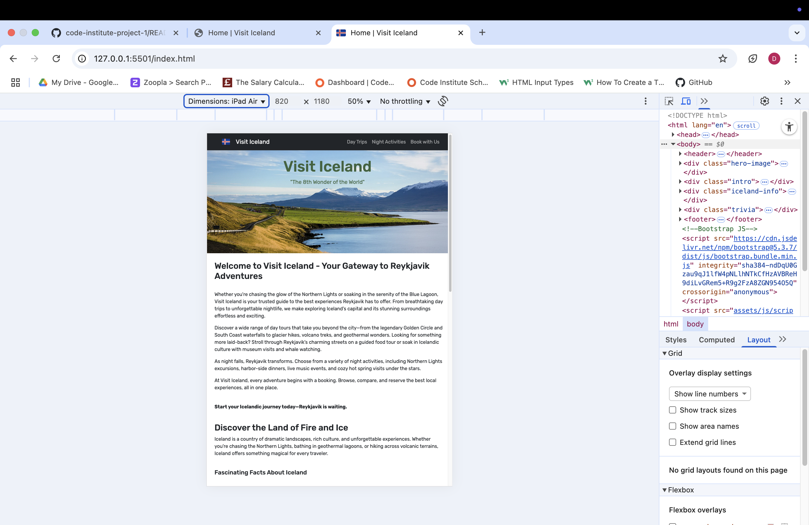

4. Trivia Quiz - The trivia quiz was tested on multiple fronts, as described below: 
 - Questions pulling though to the DOM from Javascript file - this was tested by loading the page and answering though questions to ensure that all the questions are as stated in the JS file.

 - Answers pulling through to the DOM from Javascript file - this was tested by loading the page and answering through the questuibs to ebsyre that the multiple answers are as stated in the JS file.

 - The next question button - This was tested by answering a question and checking the next button appears below the quiz. On clicking this should move onto the next question. Everything worked as designed.

 Screenshot for the above two points below:

 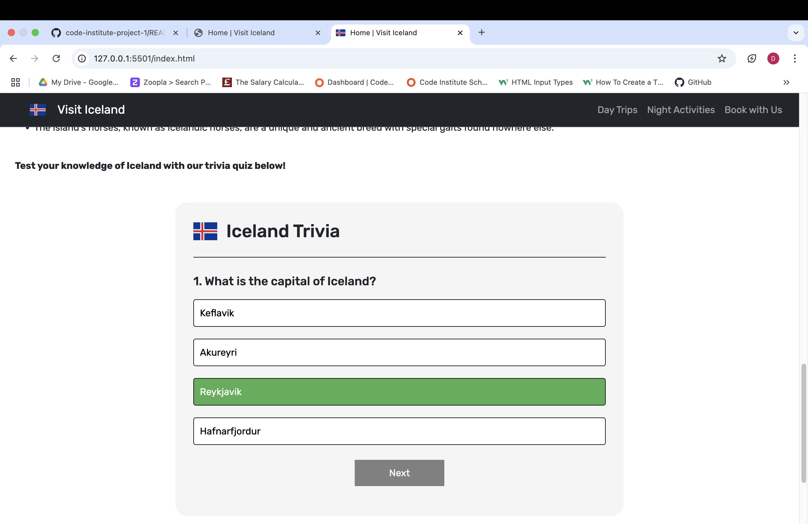
 
 - Correct and incorrect answers - This test was to check that the correct answers turned green and the incorrect turned red. To do this I answered my way through the questions twice, getting them all correct and then all incorrect. Everything worked as designed.

 - Showing the correct answer if you get an answer incorrect - This test was to check that if you get a question wrong, the script will show you the correct answer. To test this I checked that each incorrect answer also showed the correct answer. This worked as designed.

 Screenshot for above two points below:

 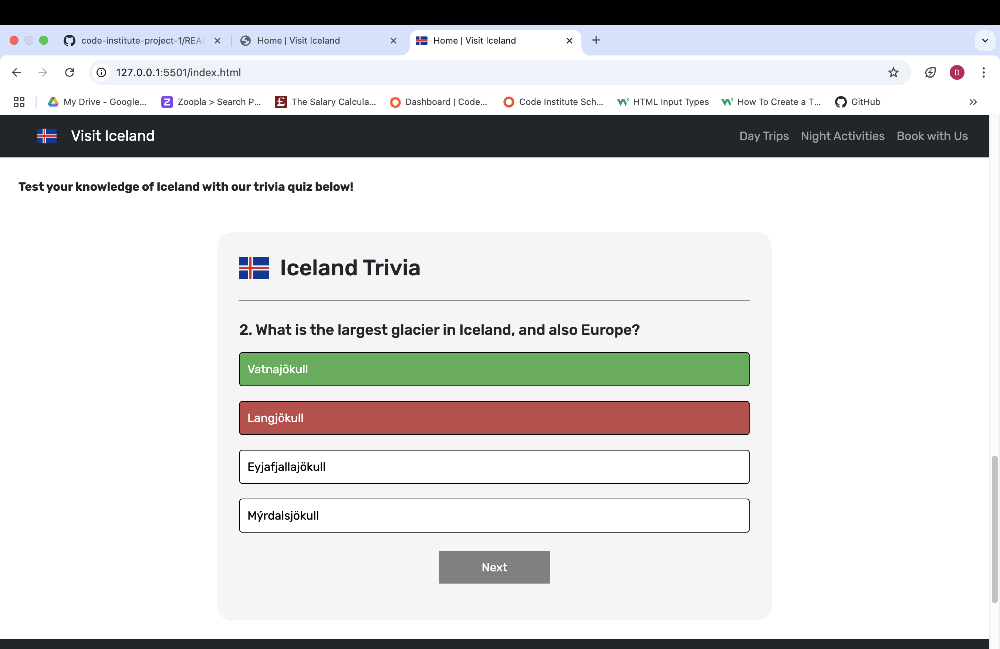

 - Calculating the user score at the end of the quiz - To test this, I just worked my way through multiple times getting different scores and ensuring the number returned at the end was accurate. This worked as designed.

 - Play again button - This test was to ensure that the play again button shows up at the end of the quiz and restarts it from the beginning. This was done by completing the quiz and clicking the button. Everything worked as designed.

 Screenshot for the above two points below:

 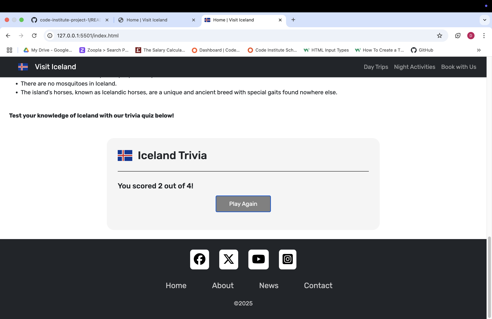

5. HTML Validation - I ran my HTML code through the W3C validator service and have provided screenshots below. My original test brought back some changes to be made so I made these and then tested again. The validation with no errors are shown below:

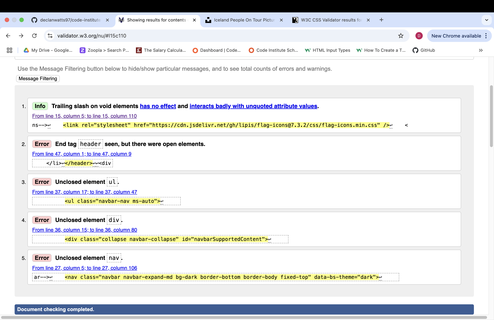

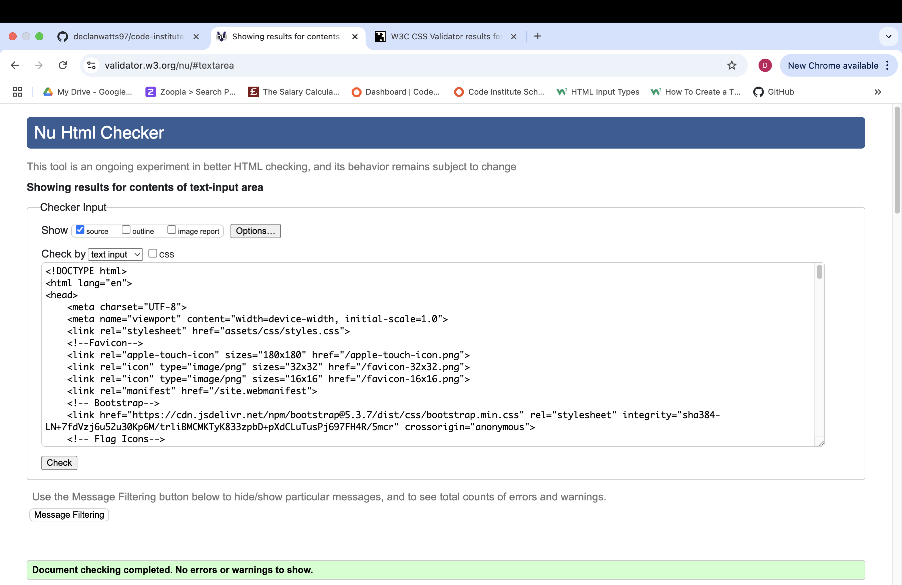

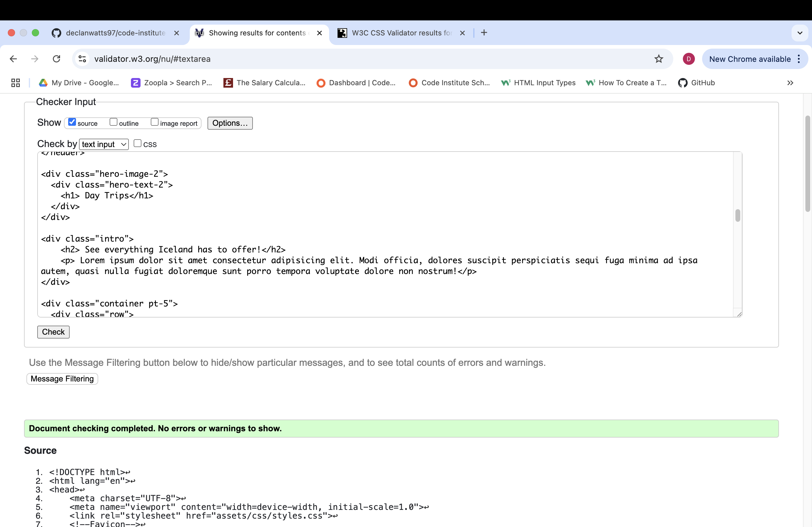

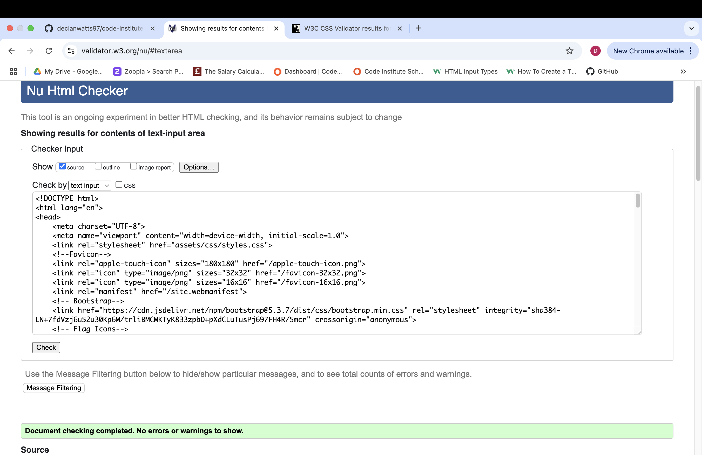

6. CSS Validation - I ran my CSS code through the W3C CSS validation service and have provided screenshots. My CSS code passed through the valifator with no errors.

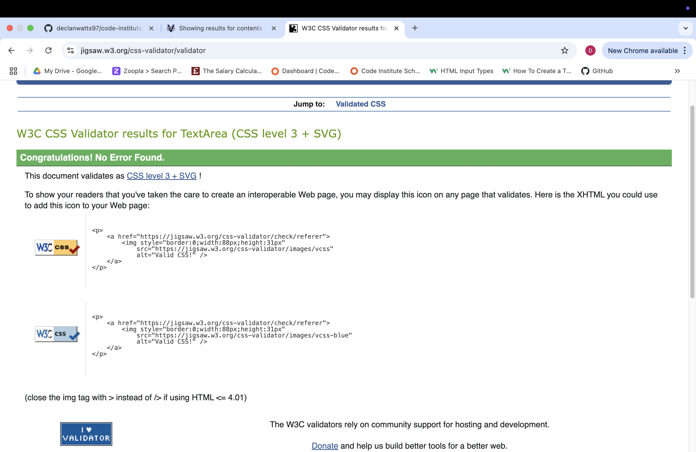

7. Javascript Validation - I ran my Javascript code through JS lint and have provided a screenshot below. My code passed through with no major issues on the validator:

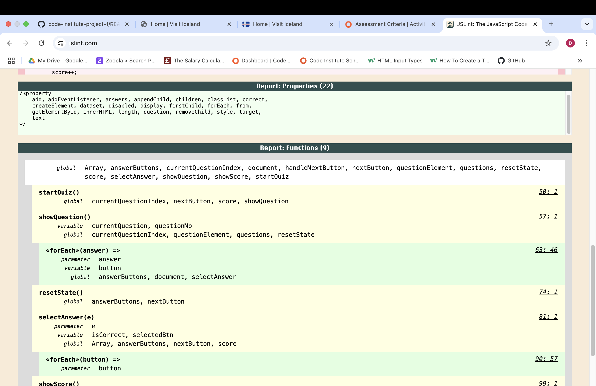

### Testing Summary

As shown in the above breakdown of testing done, the website is fully operational and meets all user story goals, while also being fully responsive across all devices and browsers.

Manual testing was used for the duration of this project. In the future, I will aim to incorporate Automated testing to this project.

### Browser Compatibility

This website was tested on the below browsers to ensure compatibility:

- Safari
- Google Chrome
- Microsoft Edge

## Credits
### Content and Inspiration
- Images: images taken from Unsplash free as uploaded by other users.
- Content: ideas taken from GetYourGuide travel pages.
- Text content - filler text taken from Chat GPT.

### Acknowledgements | All code used commented in html docs
- Bootstrap: for the navbar along with the cards outlining the different trips on offer.
- Font Awesome: for all icons used on the website.
- Code Institute: for ideas, assistance and the LMS, which was referred back to while designing this project.
- Favicon.io - for the favicon used in browser title.
- Unsplash - for all images used on the webpage.
- Flagicons.lipis.dev - for the Iceland flags used throughout the webpage.

## Contact Information
- For any queries or feedback, please contact declan.watts97@gmail.com
